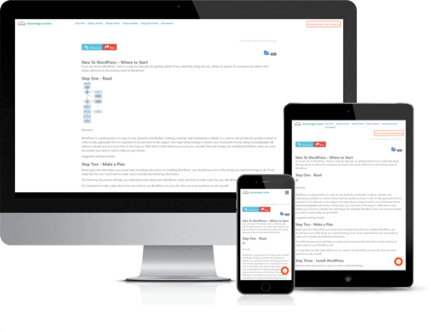

<!-- PROJECT LOGO -->
 

  

  <h3 align="center">Knowledge Center</h3>

  

    Best WordPress Knowledge Base FAQ Plugin. Help your users find information faster with easy-to-use and powerful knowledgebase, responsive FAQ.
     
     
     <a href="https://github.com/emarket-design/knowledge-center/issues">Report Bug</a>
    ·
    <a href="https://github.com/emarket-design/knowledge-center/issues">Request Feature</a>
     

<!-- ABOUT THE PROJECT -->
## About The Project

<ul><li>Allow users search all knowledgebase content of different types from one central location</li><li><a href="https://emdplugins.com/articles/enterprise-wordpress-creating-a-self-service-community/" target="_blank">Create self-service community</a> improving internal and external communication</li><li>Retain readers with content-first and easy to find information</li><li>Group, tag, contextually color content to provide meaning and association</li><li>Allow social sharing and rating of content to spread the word and promote interaction</li><li>Relate knowledge base content such as images, audios, tweets, slides, videos, terms, and articles to promote content collection</li>
<li>Reduce customer support cost and redundant effort</li>
</ul>

### Related WordPress Plugins

* [WP Ticket Starter](https://wpticketcom.emdplugins.com/) Powerful customer support and helpdesk ticketing system.
* [Software Issue Manager Starter](https://simcom.emdplugins.com/) The best in class issue and project management solution for successful projects.
* [Employee Directory Starter](https://employee-directory-com.emdplugins.com) The most complete employee directory software to power up your business.
* [Employee Spotlight Starter](https://espotlight-com.emdplugins.com) Everything you need to display and manage staff profiles.
* [Campus Directory Starter](https://campusdircom.emdplugins.com) The Best Campus Directory for Higher Education Institutions.

### Features

* [Powerful custom commenting system supporting private comments, configurable file uploads, sorting and more.](https://emdplugins.com/?p=10465&pk_campaign=knowledge-center-com&pk_kwd=github)
* [Allow access to your knowledge base from any device.](https://emdplugins.com/?p=10464&pk_campaign=knowledge-center-com&pk_kwd=github)
* [Centralize your knowledge base content to help users find information faster.](https://emdplugins.com/?p=10463&pk_campaign=knowledge-center-com&pk_kwd=github)
* [Powerful Q&A and Glossary views to help users find information fast.](https://emdplugins.com/?p=10469&pk_campaign=knowledge-center-com&pk_kwd=github) - Premium feature (included both Pro and Ent)
* [Display related images, audio, video, terms, tweets on knowledge base content pages.](https://emdplugins.com/?p=10476&pk_campaign=knowledge-center-com&pk_kwd=github) - Premium feature (Included in Ent only)
* [Create custom fields to your knowledge base content to provide additional information.](https://emdplugins.com/?p=10478&pk_campaign=knowledge-center-com&pk_kwd=github) - Premium feature (Included in Ent only)
* [Attach files to articles for users to download.](https://emdplugins.com/?p=10479&pk_campaign=knowledge-center-com&pk_kwd=github) - Premium feature (Included in Ent only)
* [Simply drag and drop knowledge base articles and everything else to  set display order.](https://emdplugins.com/?p=10620&pk_campaign=knowledge-center-com&pk_kwd=github) - Premium feature (included both Pro and Ent)
* [Awesome looking support agent pages detailing content contributions - agent info displayed as author box under each knowledge base content.](https://emdplugins.com/?p=11726&pk_campaign=knowledge-center-com&pk_kwd=github) - Premium feature (Included in Ent only)
* [Let support agents do more with easy role enhancements from plugin settings. ](https://emdplugins.com/?p=11725&pk_campaign=knowledge-center-com&pk_kwd=github) - Premium feature (Included in Ent only)
* [Powerful knowledge base dashboard  to get instant insight.](https://emdplugins.com/?p=12404&pk_campaign=knowledge-center-com&pk_kwd=github) - Premium feature (Included in Ent only)
* [Keep track of revisions to your content with ease.](https://emdplugins.com/?p=10621&pk_campaign=knowledge-center-com&pk_kwd=github) - Premium feature (included both Pro and Ent)
* [Easy ways to organize your knowledge base content.](https://emdplugins.com/?p=10619&pk_campaign=knowledge-center-com&pk_kwd=github) - Premium feature
* [Create and display related knowledge base content.](https://emdplugins.com/?p=10474&pk_campaign=knowledge-center-com&pk_kwd=github) - Premium feature
* [Display recent and featured knowledge base content with widgets.](https://emdplugins.com/?p=10618&pk_campaign=knowledge-center-com&pk_kwd=github) - Premium feature
* [Instant answers with omnisearch - allow searches on any knowledge base content from a single location.](https://emdplugins.com/?p=10470&pk_campaign=knowledge-center-com&pk_kwd=github) - Premium feature (included both Pro and Ent)
* [Beautiful knowledge base content views. ](https://emdplugins.com/?p=10623&pk_campaign=knowledge-center-com&pk_kwd=github) - Premium feature (Included in Ent only)
* [Create great looking guides combining multiple knowledge base articles.](https://emdplugins.com/?p=10480&pk_campaign=knowledge-center-com&pk_kwd=github) - Premium feature (Included in Ent only)
* [Customize your knowledge base exactly matching your brand. ](https://emdplugins.com/?p=10468&pk_campaign=knowledge-center-com&pk_kwd=github) - Premium feature
* [Create awesome looking views with ease.](https://emdplugins.com/?p=10473&pk_campaign=knowledge-center-com&pk_kwd=github) - Premium feature (included both Pro and Ent)
* [Store video, audio, slides, tweets and make them searchable.](https://emdplugins.com/?p=10622&pk_campaign=knowledge-center-com&pk_kwd=github) - Premium feature (Included in Ent only)
* [Powerful knowledge base content rating system for easy user engagement.](https://emdplugins.com/?p=10475&pk_campaign=knowledge-center-com&pk_kwd=github) - Premium feature
* [Easy social sharing of knowledge base articles with a simple click.](https://emdplugins.com/?p=10477&pk_campaign=knowledge-center-com&pk_kwd=github) - Premium feature (Included in Ent only)
* [Powerful import, export and update from or to CSV for any knowledge base content.](https://emdplugins.com/?p=10625&pk_campaign=knowledge-center-com&pk_kwd=github) - Add-on (included both Pro and Ent)
* [Smart search for any content including content ratings.](https://emdplugins.com/?p=10624&pk_campaign=knowledge-center-com&pk_kwd=github) - Add-on (included both Pro and Ent)

<!-- GETTING STARTED -->
## Getting Started

### Watch Introduction Video 

 

To get a local copy up and running follow these simple example steps.

### Knowledge Center WordPress Plugin Links

 * [Knowledge Center Starter Demo Site](https://kcentercom.emdplugins.com/?pk_campaign=knowledge-center-com&pk_kwd=readme)
* [Knowledge Center Starter Documentation](https://docs.emdplugins.com/knowledge-center-community/?pk_campaign=knowledge-center-com&pk_kwd=readme)
* [Knowledge Center Professional Demo Site](https://kcenter-pro.emdplugins.com/?pk_campaign=knowledge-center-com&pk_kwd=readme)
* [Knowledge Center Professional Documentation](https://docs.emdplugins.com/knowledge-center-professional/?pk_campaign=knowledge-center-com&pk_kwd=readme)
* [Knowledge Center Professional Changes](https://emdplugins.com/articles/kc-pro-wordpress-plugin-changelog/?pk_campaign=knowledge-center-com&pk_kwd=readme)
* [Knowledge Center Enterprise Demo Site](https://kcenter-ent.emdplugins.com/?pk_campaign=knowledge-center-com&pk_kwd=readme)
* [Knowledge Center Enterprise Documentation](https://docs.emdplugins.com/knowledge-center-enterprise/?pk_campaign=knowledge-center-com&pk_kwd=readme)
* [Knowledge Center Enterprise Changes](https://emdplugins.com/articles/kc-ent-wordpress-plugin-changelog/?pk_campaign=knowledge-center-com&pk_kwd=readme)

### Installation

#### Using This Page
* Click on Clone or Download button on this page. Click, and you can see a drop-down box having two options, click on Download ZIP.
* Login to your website and go to the Plugins section of your admin panel.
* Click the Add New button.
* Under Install Plugins, click the Upload link.
* Select the plugin zip file from your computer then click the Install Now button.
* You should see a message stating that the plugin was installed successfully.
* Click the Activate Plugin link.

#### Using WordPress

The simplest way to install is to click on WordPress 'Plugins' page then 'Add' and type 'Knowledge Center' in the search field.

##### Manual Installation Type 1

* Login to your website and go to the Plugins section of your admin panel.
* Click the Add New button.
* Under Install Plugins, click the Upload link.
* Select the plugin zip file from your computer then click the Install Now button.
* You should see a message stating that the plugin was installed successfully.
* Click the Activate Plugin link.

##### Manual Installation Type 2

* You should have access to the server where WordPress is installed. If you don't, see your system administrator.
* Copy the plugin zip file up to your server and unzip it somewhere on the file system.
* Copy the "knowledge-center" folder into the /wp-content/plugins directory of your WordPress installation.
* Login to your website and go to the Plugins section of your admin panel.
* Look for "Knowledge Center" and click Activate.

<!-- CONTRIBUTING -->
## Contributing

Contributions are what make the open source community such an amazing place to learn, inspire, and create. Any contributions you make are **greatly appreciated**.

1. Fork the Project
2. Create your Feature Branch (`git checkout -b feature/AmazingFeature`)
3. Commit your Changes (`git commit -m 'Add some AmazingFeature'`)
4. Push to the Branch (`git push origin feature/AmazingFeature`)
5. Open a Pull Request

<!-- LICENSE -->
## License

Distributed under the GPLv2 or later License. See [`LICENSE`](https://www.gnu.org/licenses/gpl-2.0.html) for more information.

<!-- CONTACT -->
## MORE INFO

[Knowledge Center](https://emdplugins.com/plugins/knowledge-center-wordpress-plugin/) - WORDPRESS PLUGIN PAGE